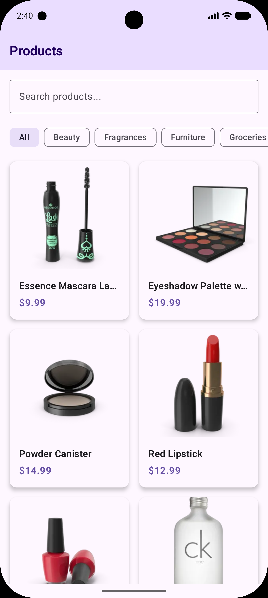
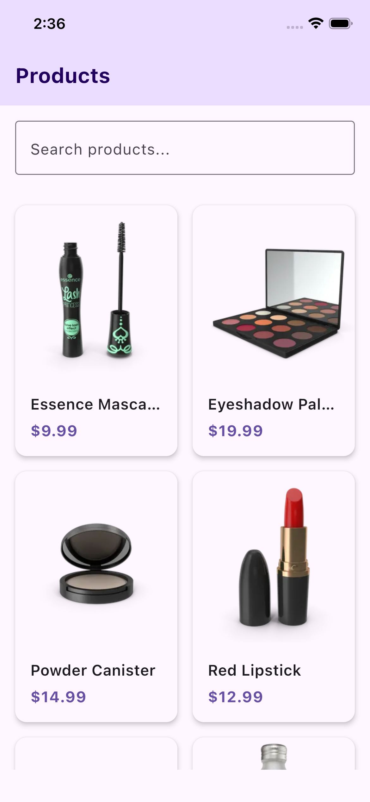
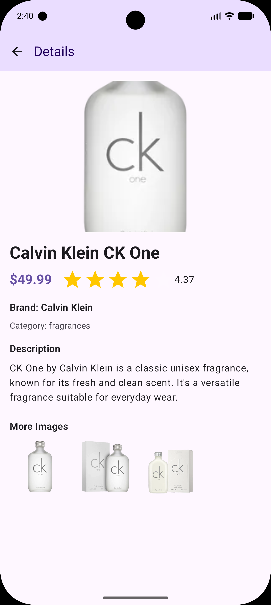
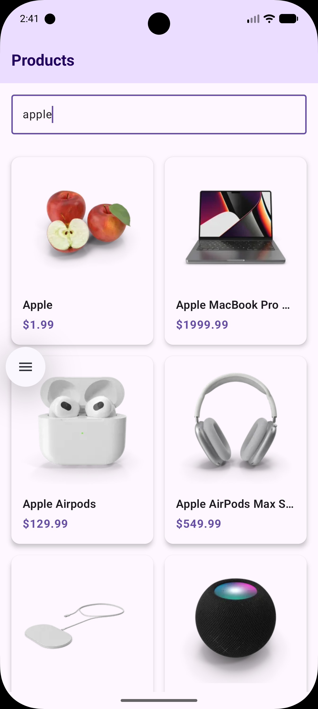
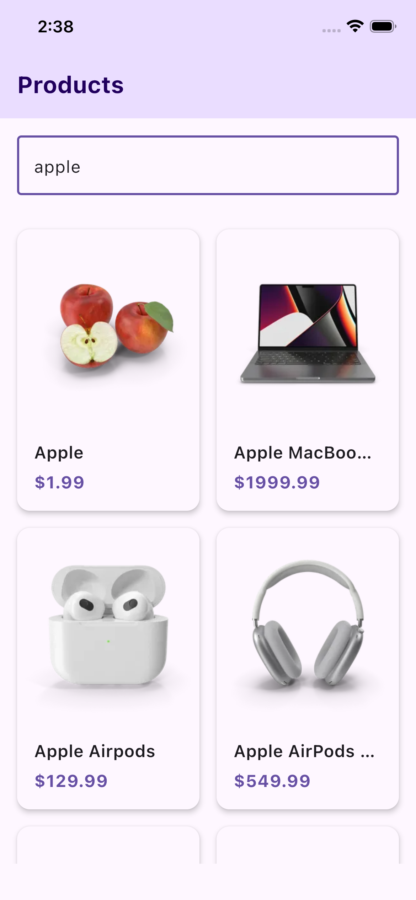
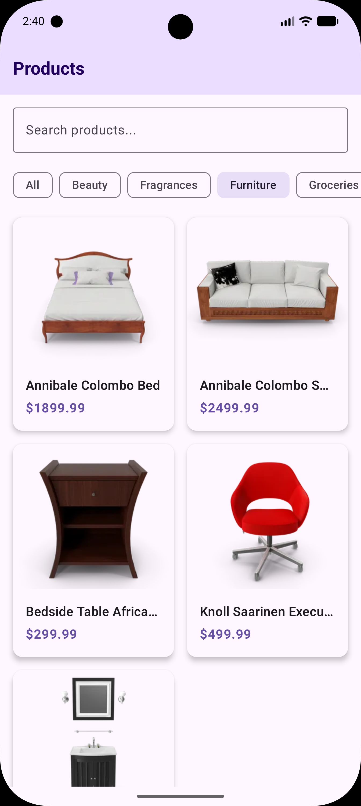
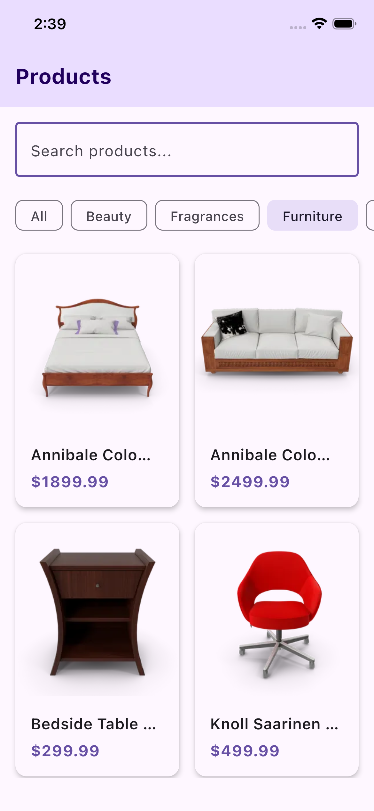

# Product Browser App (KMP)

This is a Kotlin Multiplatform (KMP) application that allows users to browse products, view details, search by keyword, and filter by categories. It consumes data from the public API: `https://dummyjson.com/docs/products.

## Business Requirements Summary
- **Product List**: Displays a list of products with title, price, and thumbnail.
- **Product Detail**: Allows tapping a product to see extended details including descriptions, brand, full price, rating, and additional images.
- **Search**: Integrated search functionality against the DummyJson API.
- **Filter**: Filter product lists by fetching available categories and applying them to the search criteria.

## Project Architecture
The application follows Clean Architecture concepts:
- **Presentation Layer**: UI Components built using Compose Multiplatform. 
  - `ViewModel`s using `StateFlow` to manage reactive states for the UI.
- **Domain Layer**: Contains fundamental business rules.
  - Models (`Product`) and repository abstraction (`ProductRepository`).
  - Use Cases (`GetProductsUseCase`, `SearchProductsUseCase`, `GetProductDetailUseCase`, etc.) encapsulating business logic.
- **Data Layer**: Implements repository abstractions and data fetching.
  - Integrates `Ktor` client for networking and `kotlinx.serialization` for parsing.
  - Includes a simple in-memory local caching strategy mapping requested products to maps and arrays to avoid redundant fetches on repeated category/detail calls.
- **DI (Dependency Injection)**: Utilizes `Koin` to inject dependencies automatically across common layers, view models, and repositories.

## Trade-offs & Assumptions
- **Caching**: Currently utilizing a fast in-memory map mechanism (`MutableMap` and `MutableList`) to keep the initial application simple, lightweight, and focused on showcasing core app requirements efficiently. 
- **Image Loading**: Included `coil3` (Coil Compose Multiplatform) which seamlessly handles cross-platform Compose image loading configured with Ktor network fetcher.
- **Architecture mapping**: Shared components and presentation are natively implemented entirely in `commonMain` utilizing Compose Multiplatform.

## How to Build and Run

### Android
Requirements: Android Studio or later with Kotlin Multiplatform plugins.
1. Open the project in Android Studio.
2. Ensure you have an Android device or emulator running.
3. Select the `composeApp` run configuration (or `app`) targeting the Android emulator.
4. Click **Run** to build and deploy.  

### iOS
Requirements: A Mac with Xcode 15+ installed.
1. Open the Android Studio project, and run the `iosApp` run configuration from the toolbar OR open `iosApp/iosApp.xcworkspace` in Xcode.
2. Select the target iOS Simulator (e.g., iPhone 16e). 
3. Click **Run** to build and deploy the iOS application using shared Compose UI.

## Screenshots

| Android | iPhone |
|---------|--------|
| **Product List** | **Product List** |
|  |  |
| **Product Details** | **Product Details** |
|  |  |
| **Search** | **Search** |
|  |  |
| **Search by Category** | **Search by Category** |
|  |  |
